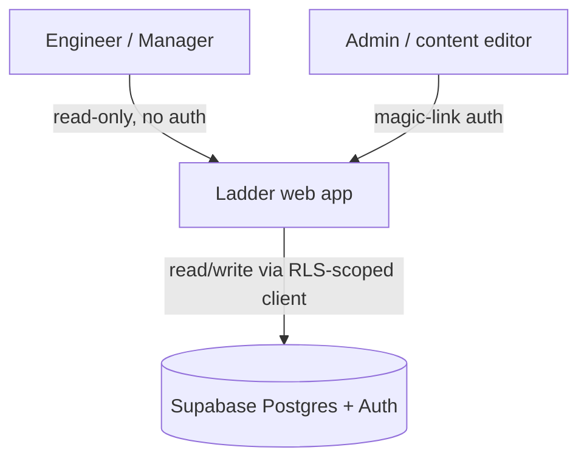

# Architecture — Ladder

> Greenfield note: no application code exists yet. Container/stack choices below are INFERRED
> from `design/01–06-*.md` (which reference Next.js middleware, Supabase Auth, Supabase REST/
> RLS directly) — not yet ratified by a human decision or ADR. Treat as proposed, confirm or
> correct before relying on it for a TSD.

## System Context

## Containers
- **Ladder web app** (inferred: Next.js) — serves public read routes (competency browser, badge/
  assessment viewer, training viewer, version history — design/01–04) and admin routes under
  `/admin/*` (CMS — design/05), gated by middleware/route-group auth check (design/06).
- **Supabase Postgres** — single datastore for all content entities (`competencies`,
  `primary_functions`, `standards`, `badges`, `instruments`, `training_units`,
  `functional_analyses`, `document_versions`) plus `admin_users`. RLS policies enforce public
  SELECT / admin-only write per-table (design/06).
- **Supabase Auth** — magic-link email sign-in for admins only; no public user accounts in v1
  (design/06).

## Boundary Rules
- Public routes (competency browser, badge/assessment/training viewers, version history) never
  require a session and never render admin chrome — inferred from design/01 §Acceptance criteria
  ("No auth required to view any route") and design/06 §Scope.
- All content-table writes go through Supabase RLS policies checking `auth.uid() IN admin_users`
  — enforced at the database layer, not just app-level route protection (design/06 AC: "rejected
  by RLS ... independent of app-level route protection").
- Every entity write produces exactly one `document_versions` snapshot row in the same
  transaction as the entity update (design/05 §Save flow) — version history (design/04) has no
  separate write path.
- Shared display primitives (`<TierChip>`, `<LevelTabs>`, `<LevelTabContent>`, `<EmptyState>`)
  are owned by the competency-browser feature and imported, not redefined, by sibling features
  (design/01 §Components, design/02/03 AC: "reuse the exact component").

## Governing ADRs
- [ADR-0001 — Record architecture decisions](../adr/0001-record-architecture-decisions.md)
<!-- add links as ADRs are written, e.g. [ADR-0002 title](../adr/0002-slug.md) -->
