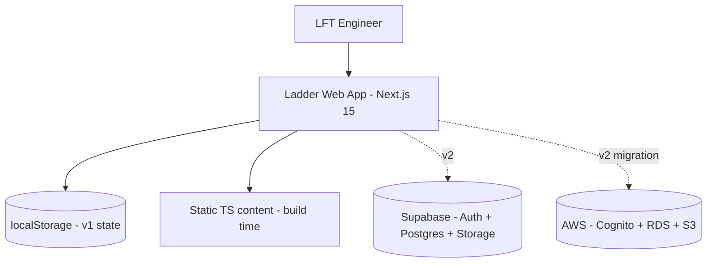

# Architecture — Ladder

## System Context


```mermaid
graph TD
  engineer[LFT Engineer] --> ladder[Ladder Web App - Next.js 15]
  ladder --> localStorage[(localStorage - v1 state)]
  ladder --> content[Static TS content - build time]
  ladder -.->|v2| supabase[(Supabase - Auth + Postgres + Storage)]
  ladder -.->|v2 migration| aws[(AWS - Cognito + RDS + S3)]
```

## Containers

### Next.js 15 App Router (single container — v1)
- **Responsibility:** All rendering, routing, and client-side state
- **Deployment:** Vercel (zero-config, GitHub CI/CD, preview deploys per PR)
- **Rendering:** Static site generation at build time for all pages; client components only where Zustand store access is required
- **Routing:**
  - `/` — Home: track picker + level picker
  - `/[track]` — Domain overview: domain cards with progress rings
  - `/[track]/[domain]` — Domain detail: competency list (or coming-soon placeholder)
  - `/[track]/[domain]/[competency]` — Competency detail: all levels, criteria checkboxes, self-rating, focused view toggle

### Static Content Layer (build-time only)
- **Location:** `src/content/tracks.ts`
- **Responsibility:** Exports `tracks: Track[]` — all competency content as static TypeScript. No runtime markdown parsing in v1.
- **Source:** Authored from `competencies/lft-engineering-competency-matrix.md` and track-specific markdown files
- **Extension:** New tracks/competencies added by dropping markdown into `competencies/` — no code change required (in v2; in v1 content is static TS)

### Zustand Assessment Store (client-side)
- **Location:** `src/lib/store.ts`
- **Responsibility:** All user state: currentTrack, currentLevel, focusedView, assessments (selfRating + criteriaChecked per competency)
- **Persistence:** `zustand/middleware/persist` → localStorage key `ladder-store`
- **Hydration:** Always `skipHydration: true`; always call `useStore.persist.rehydrate()` inside `useEffect` in client components — never at module level

### Content Utility Layer
- **Location:** `src/lib/content.ts`
- **Responsibility:** Pure functions over static track data: `getTracks`, `getTrack`, `getDomain`, `getCompetency`, `getNextLevel`, `computeProgress`
- **Rule:** No side effects; no store access; functions are pure (state) → value

## Boundary Rules

- All content access goes through `src/lib/content.ts` utility functions — never import `src/content/tracks.ts` directly in components
- All user state access goes through the Zustand store (`src/lib/store.ts`) — never manage assessment state in component local state
- Server components pass data as props to client components; client components are the only ones that call `useStore`
- No runtime markdown parsing in v1 — all content is static TypeScript at build time
- `getNextLevel('p7')` must return `null` — never access a level beyond P7
- Coming-soon domains: `comingSoon: true`, `competencies: []` — render placeholder only, never attempt to render criteria
- Assessment key format (Zustand store key): `{trackId}/{domainId}/{competencyId}` — always this exact format
- Criterion ID format: `{shared|dev|qa|data|ai}/{domainId}/{competencyId}/{level}/{index}` — 0-indexed; universal domain criteria use `shared` prefix

## Data Shapes

### localStorage schema (v1)
```json
{
  "currentTrack": "dev",
  "currentLevel": "p4",
  "focusedView": true,
  "assessments": {
    "dev/technical-skill/writing-code": {
      "selfRating": "meeting",
      "criteriaChecked": ["dev/technical-skill/writing-code/p4/0"],
      "updatedAt": "2026-09-26T10:00:00Z"
    }
  }
}
```

### v2 Postgres schema (planned — provider-agnostic)
```sql
assessments      (id, user_id, track, domain, competency, level, self_rating, updated_at)
criteria_checks  (id, assessment_id, criteria_id, met)
evidence_files   (id, assessment_id, criteria_id, storage_key, filename, uploaded_at)
```

## Governing ADRs
- [ADR-0001 — Record architecture decisions](../adr/0001-record-architecture-decisions.md)
